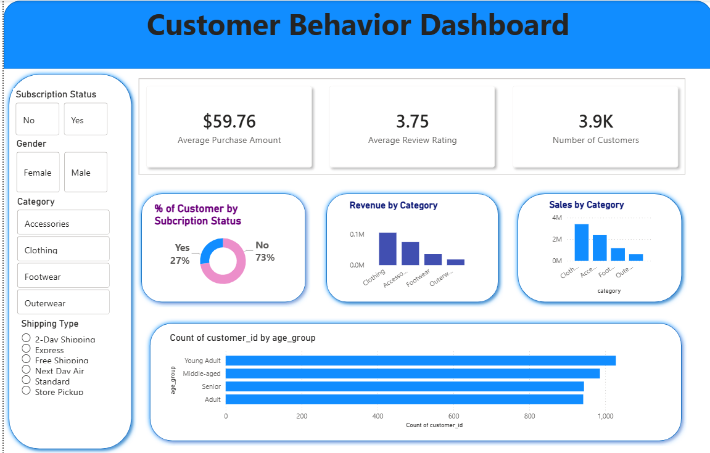

🛒 Customer Purchase Behavior Analysis (Power BI)

An end-to-end data analytics project that explores customer purchase behavior to identify buying patterns, customer segments, and product performance.
The project analyzes transaction data to uncover revenue-driving segments, seasonal trends, and actionable business insights that support data-driven decision-making.

📌 Project Objective

This project analyzes customer shopping behavior to uncover purchasing patterns, revenue-driving segments, and seasonal trends.
The goal is to generate meaningful insights that help businesses optimize marketing strategies, inventory planning, and customer engagement.

🛠 Tools & Technologies
Python (Pandas, NumPy, Matplotlib, Seaborn)
Jupyter Notebook
Power BI

💡 Skills Demonstrated
Data Cleaning & Preprocessing
Exploratory Data Analysis (EDA)
Data Visualization
Business Insight Generation
Dashboard Development (Power BI)

📊 Dataset Overview
Rows: 3,900
Columns: 18
Key Features: Age, Gender, Category, Purchase Amount, Season, Subscription Status, Discount Applied, Payment Method
The dataset contains customer shopping transactions used to analyze behavior patterns, revenue trends, and customer contribution.
Source: Customer Shopping Behavior Dataset

🔎 Key Insights
Total revenue generated: $233,081
Clothing is the highest revenue-generating category
Male customers contribute a larger share of total revenue
Sales remain consistent across seasons, with Fall slightly leading
Subscription status shows minimal impact on average purchase value

📈 Business Recommendations
Prioritize inventory and promotions for Clothing, the top-performing category
Target marketing strategies toward high-spending customer segments
Maintain balanced seasonal inventory due to steady demand
Improve subscription benefits to increase customer lifetime value

🚀 Project Workflow
Data Cleaning & Preprocessing
Exploratory Data Analysis (EDA)
Customer Trend & Behavior Analysis
Data Visualization
Business Insights & Recommendations

🖼 Dashboard Preview
Interactive Power BI dashboard showing customer trends, revenue distribution, and purchasing behavior.

